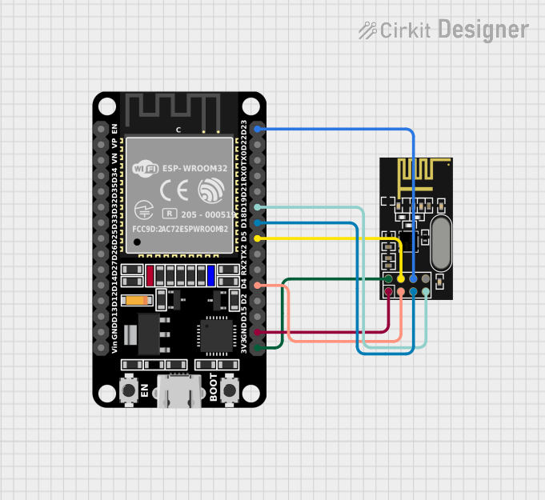
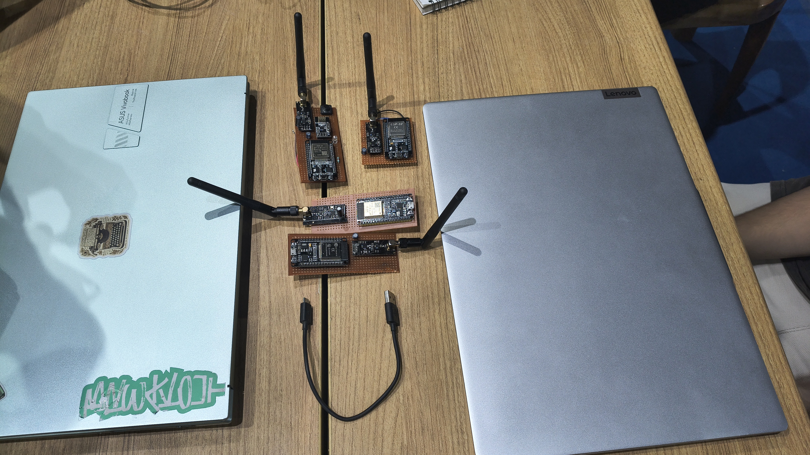
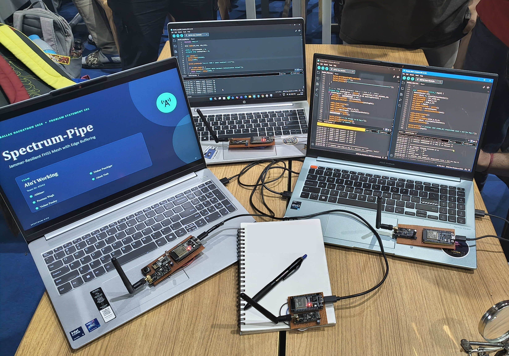

# FHHS — Frequency-Hopping Store-and-Forward Mesh

A 3-node wireless mesh built on ESP32 + nRF24L01, implementing a custom **frequency-hopping spread spectrum (FHSS)** link with **store-and-forward** relaying, packet encryption, and CRC-verified delivery — all from a bit-banged SPI driver with no external radio library.

```
Node A (Source) ──► Node B (Relay) ──► Node C (Destination)
```

- **Node A** reads messages from Serial and injects them into the mesh.
- **Node B** receives, persists to flash, and forwards — surviving reboots without losing queued data.
- **Node C** receives, decrypts, verifies, and prints the final message.

## How it works

**Synchronization.** All nodes boot on a fixed rendezvous channel. Node A broadcasts `SYNC` packets until both B and C reply `READY`, then transmits a `START` packet carrying a future epoch number. Every node begins hopping from that same epoch, so the mesh comes up in lock-step without a shared clock.

**Frequency hopping.** Time is divided into 600 ms epochs, each epoch mapped to one of 8 channels via a fixed hop table. Each epoch is split into two 250 ms slots — one for the A→B hand-off, one for B→C — with guard bands to absorb radio settling and timing drift.

**Store-and-forward.** Node B never forwards directly from the air: every packet it receives from A is written to flash (via `Preferences`) *before* it is acknowledged, and only removed from the queue once C confirms receipt. If C is unreachable, the packet stays queued and retries on the next epoch — and survives a power cycle on B.

**Packet integrity & security.** Every packet is a fixed 32-byte struct, protected by a CRC32 checksum computed over the packet body. Application payloads are additionally encrypted with XTEA before transmission and decrypted only at the destination.

**Radio driver.** The nRF24L01 is driven directly over bit-banged SPI (manual clock/MOSI/MISO toggling), with hardware auto-ack disabled — acknowledgment, retries, and sequencing are all handled in application logic instead.

## Repository layout

| Path | Description |
|---|---|
| `Node_A/Node_A.ino` | Source node — reads Serial input, encrypts & queues messages, initiates network sync |
| `Node_B/Node_B.ino` | Relay node — store-and-forward buffer with flash persistence |
| `Node_C/Node_C.ino` | Destination node — decrypts, verifies, and prints incoming messages |
| `Images/` | Wiring diagram and hardware photos |

All three sketches share the same codebase, differentiated only by their `NODE_ID` / `NODE_ROLE` `#define`s at the top of the file.

## Hardware

Each node is an **ESP32 (ESP-WROOM-32)** paired with an **nRF24L01** radio module.



| ESP32 Pin | nRF24L01 Pin |
|---|---|
| GPIO4 | CE |
| GPIO5 | CSN |
| GPIO18 | SCK |
| GPIO23 | MISO |
| GPIO19 | MOSI |
| 3V3 | VCC |
| GND | GND |





## Getting started

1. Flash `Node_A/Node_A.ino` to one ESP32, `Node_B/Node_B.ino` to a second, and `Node_C/Node_C.ino` to a third, wiring each nRF24L01 as shown above.
2. Power on B and C first (or in any order — they'll wait on the rendezvous channel), then power on A.
3. Open a Serial monitor at `115200` baud on Node A.
4. Type a message and press Enter — it will hop A → B → C, and the decrypted result will print on Node C's Serial monitor.

Each node prints a periodic status block (sync state, current epoch/channel/hop, and queue depth) for debugging the mesh live.
